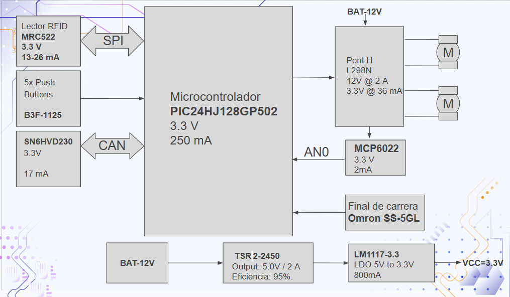

View this project on [CADLAB.io](https://cadlab.io/project/30192). 

# Projecte ALÇA-VIDRES

>**Autors:** Àlex Requena , Alfred Abanto
>**Versió:** v3.2

----------

## Objectiu

>PCB per controlar les portes d'un cotxe.
Control de finestres
Controls de seguretat en finestres
Sistema de tancament i obertura de portes
Obertura de portes amb un lector RFID

## Diagrama de blocs

### Descripció/funcionalitat de cada bloc
Microcontrolador PIC24HJ: Cervell del sistema; processa dades i coordina tots els mòduls i comunicacions.

Lector RFID MFRC522: Mòdul de comunicació sense contacte per a identificació de targetes via interfície SPI.

Polsadors B3F: Interfície d'usuari per a l'activació manual de funcions del sistema.

Transceptor CAN TJA1051: Interfície de comunicació robusta per a l'enviament de dades a llarga distància.

Pont H L298N: Driver de potència per controlar el gir i la velocitat de dos motors DC.

Amp. Op. MCP6022: Condiciona senyals analògics (com el consum dels motors) per a una lectura precisa del micro.

Final de carrera SS-01GL111-ET: Sensor mecànic de seguretat que detecta el límit de moviment físic.

Conversor TSR 2-2450: Transforma eficientment els 12V de la bateria en 5V estables.

Regulador LM1117-3.3: Redueix els 5V a 3.3V per alimentar la lògica i els xips de control.
## Requisits / Especificacions

----

## Components

| Descripci&#243; | Ref | Package |Datasheet | Prove&#239;dor | Preu | Unitats |
| Driver de Motor (Puente H) | L298N | TO-220-15 | [Datasheet](https://www.alldatasheet.com/datasheet-pdf/view/22440/STMICROELECTRONICS/L298N.html) | [Mouser](https://www.mouser.es/c/?q=L298N) | 10.31 &euro; | 1x |

| Convertidor DC-DC | TSR2-2450 | SIP-3 | https://www.tracopower.com/products/tsr2.pdf | https://www.mouser.es/c/?q=TSR2-2450 | 10.41 € | 1x |

| Amplificador Op. | MCP6022 | SOIC-8 | [Datasheet](https://www.alldatasheet.com/datasheet-pdf/view/99099/MICROCHIP/MCP6022.html) | [Mouser](https://www.mouser.es/c/?q=MCP6022) | 1.53 &euro; | 1x |
-----------
| Regulador LDO | LM1117DT-3.3 | TO-252 | https://www.ti.com/lit/ds/symlink/lm1117.pdf | https://www.mouser.es/c/?q=LM1117DT-3.3 | 1.5 € | 1x |
| Lector RFID | MFRC52201HN1_157 | HVQFN-32 | https://www.nxp.com/docs/en/data-sheet/MFRC522.pdf | https://www.mouser.es/c/?q=MFRC52201HN1_157 | 6.8€ | 1x |

| Microcontrolador | PIC24HJ64GP504-I/PT | TQFP-44 | https://ww1.microchip.com/downloads/en/DeviceDoc/70293G.pdf | https://www.mouser.es/c/?q=PIC24HJ64GP504-I/PT | 5.75 € | 1x |

| Transceptor CAN | SN65HVD230 | SOIC-8 | https://www.ti.com/lit/ds/symlink/sn65hvd230.pdf | https://www.mouser.es/c/?q=SN65HVD230 | 1.91 € | 1x |

| Ferrita | FerriteBead | SMD 0805 | https://www.vishay.com/docs/34025/ilbb0805.pdf| [Mouser](https://www.mouser.es/c/?q=Ferrite%20Bead%200805) | 0.08 &euro; | 1x |

| Conector D-Sub 9 | A-DF 09 LL/Z | THT | https://www.assmann-wsw.com/fileadmin/datasheets/ASS_0212_CO.pdf | https://www.mouser.es/c/?q=A-DF+09+LL%2FZ | 2.18 € | 2x |
## Software
Kicad
### Eines:

  * KiCad 10.0 
  

### Funcionalitats:
Controlar finestres.

Controls de seguretat en finestres.

Sistema de tancament i obertura de portes.

Obrir portes amb un lector RFID.

-----------

## Historial de canvis
|11/03| Alfred | Main | v0.0 | Diagrama de blocs i 
components |
|18/03| Àlex | Main | v0.1 | Esquemàtic i simulacions |
| 25/03| Àlex | Main | v1 | layoutv1|
| 10/04| Alfred | Main | v2 | layoutv2, dues etapes|
| 10/04| Alfred | Main | v3.0 | layoutv2, redistribució|
| 22/04| Àlex | Main | v3.1 | layoutv3, errors arreglats|
| 27/04| Àlex i Alfred | Main | v3.2| layoutv3, layout final|
