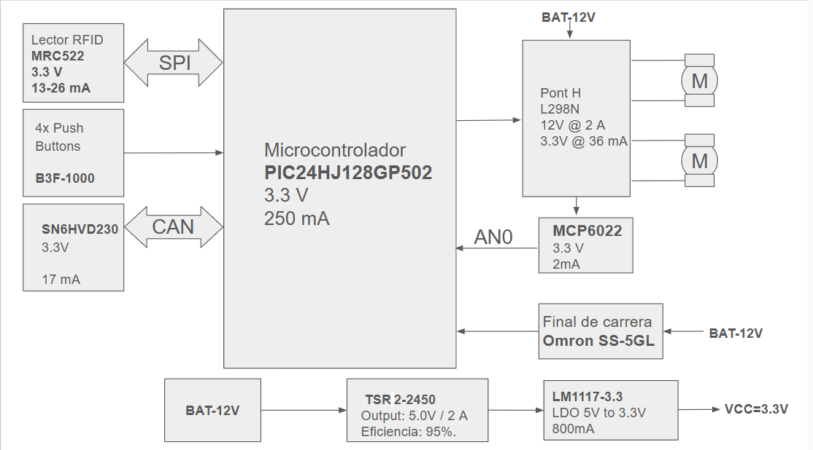

View this project on [CADLAB.io](https://cadlab.io/project/30192). 

# Projecte ALÇA-VIDRES

>**Autors:** Àlex Requena , Alfred Abanto
>**Versió:** v0-001 

----------

## Objectiu

>PCB per controlar les portes d'un cotxe.

## Diagrama de blocs

### Descripció/funcionalitat de cada bloc
Microcontrolador PIC24HJ: Cervell del sistema; processa dades i coordina tots els mòduls i comunicacions.

Lector RFID MFRC522: Mòdul de comunicació sense contacte per a identificació de targetes via interfície SPI.

Polsadors B3F: Interfície d'usuari per a l'activació manual de funcions del sistema.

Transceptor CAN TJA1051: Interfície de comunicació robusta per a l'enviament de dades a llarga distància.

Pont H L298N: Driver de potència per controlar el gir i la velocitat de dos motors DC.

Amp. Op. MCP6022: Condiciona senyals analògics (com el consum dels motors) per a una lectura precisa del micro.

Final de carrera SS-5GL: Sensor mecànic de seguretat que detecta el límit de moviment físic.

Conversor TSR 2-2450: Transforma eficientment els 12V de la bateria en 5V estables.

Regulador LM1117-3.3: Redueix els 5V a 3.3V per alimentar la lògica i els xips de control.
## Requisits / Especificacions

----

## Components

| Descripci&#243; | Ref | Package |Datasheet | Prove&#239;dor | Preu | Unitats |
| Driver de Motor (Puente H) | L298N | TO-220-15 | [Datasheet](https://www.alldatasheet.com/datasheet-pdf/view/22440/STMICROELECTRONICS/L298N.html) | [Mouser](https://www.mouser.es/c/?q=L298N) | TBD &euro; | 1x |

| Conversor DC-DC | TSR2-2450 | THT SIP | [Datasheet](https://www.tracopower.com/tsr2-datasheet) | [Mouser](https://www.mouser.es/c/?q=TSR2-2450) | TBD &euro; | 1x |

| Amplificador Op. | MCP6022 | SOIC-8 | [Datasheet](https://www.alldatasheet.com/datasheet-pdf/view/99099/MICROCHIP/MCP6022.html) | [Mouser](https://www.mouser.es/c/?q=MCP6022) | TBD &euro; | 1x |
-----------
Regulador Lineal (800-mA) | LM1117DT-3.3 | TO-252-3 | [Datasheet (Rev. Q)](http://www.ti.com/lit/ds/symlink/lm1117.pdf) | [Mouser](https://www.mouser.es/c/?q=LM1117DT-3.3) | TBD &euro; | 1x |

| Lector RFID | PN5120A0HN1 | HVQFN-32 | [Datasheet](https://www.alldatasheet.com/datasheet-pdf/view/417974/NXP/PN5120A0HN1.html) | [Mouser](https://www.mouser.es/c/?q=PN5120A0HN1) | TBD &euro; | 1x |

| Microcontrolador | PIC24HJ128GP502 | SSOP-28 | [Datasheet](https://ww1.microchip.com/downloads/aemDocuments/documents/OTH/ProductDocuments/DataSheets/70293G.pdf) | [Mouser](https://www.mouser.es/c/?q=PIC24HJ128GP502) | TBD &euro; | 1x |

| High-speed CAN transceiver | TJA1051TK-3 | HVSON-8 | [Datasheet](https://www.nxp.com/docs/en/data-sheet/TJA1051.pdf) | [Mouser](https://www.mouser.es/c/?q=TJA1051TK-3) | TBD &euro; | 1x |

8-ch analog switch MUX/DEMUX (1.5V to 5.5V) | NMUX1308PW | TSSOP-16 | [Datasheet](https://assets.nexperia.com/documents/data-sheet/NMUX1308.pdf) | [Mouser](https://www.mouser.es/c/?q=NMUX1308PW) | TBD &euro; | 1x |

| Cristal de Cuarzo | ABM12W-27.0000MHZ-6-B1U-T3 | SMD HC49-SD |https://www.mouser.es/datasheet/3/184/1/ABM12W.pdf| [Mouser](https://www.mouser.es/c/?q=Crystal%2027.12MHz) | TBD &euro; | 1x |

| Cristal de Cuarzo |MCO-1510A/8MHz| SMD HC49-SD |https://datasheet4u.com/pdf/539558/MCO-1510A.pdf| [Mouser](https://www.mouser.es/c/?q=Crystal%208MHz) | TBD &euro; | 1x |

| Ferrita | FerriteBead | SMD 0805 | https://www.vishay.com/docs/34025/ilbb0805.pdf| [Mouser](https://www.mouser.es/c/?q=Ferrite%20Bead%200805) | TBD &euro; | 1x |

## Software

### Eines:

  * KiCad 10.0 

### Configuraci&#243; :

   

### Funcionalitats:
Controlar finestres.

Controls de seguretat en finestres.

Sistema de tancament i obertura de portes.

Obrir portes amb un lector RFID.

-----------

## Historial de canvis

| Data | Autor     | Branch | Versi&#243; | Descripci&#243; |
| --- | --- | --- | --- | --- |
|  28/03/2023 | mlopez | Master | initial commit | Primera versi&#243; d'esquem&#224;tic i selecci&#243; de components |
